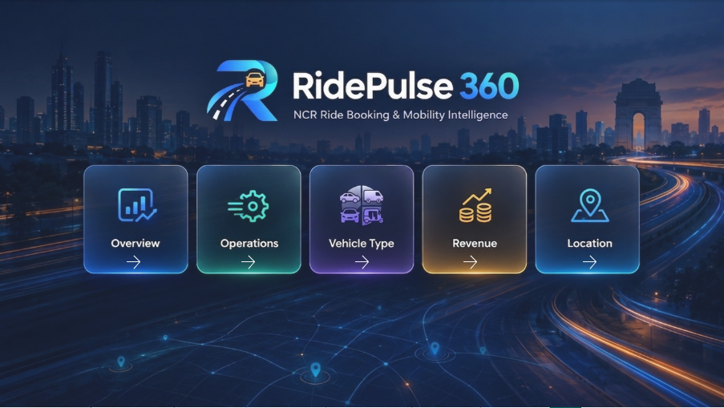
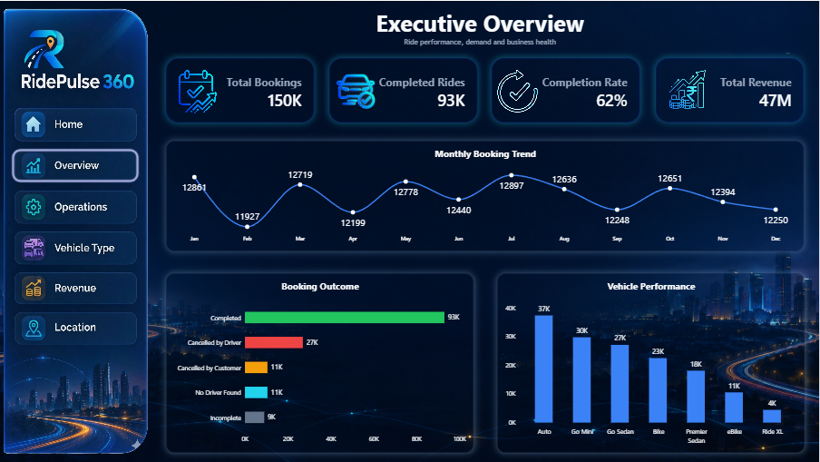
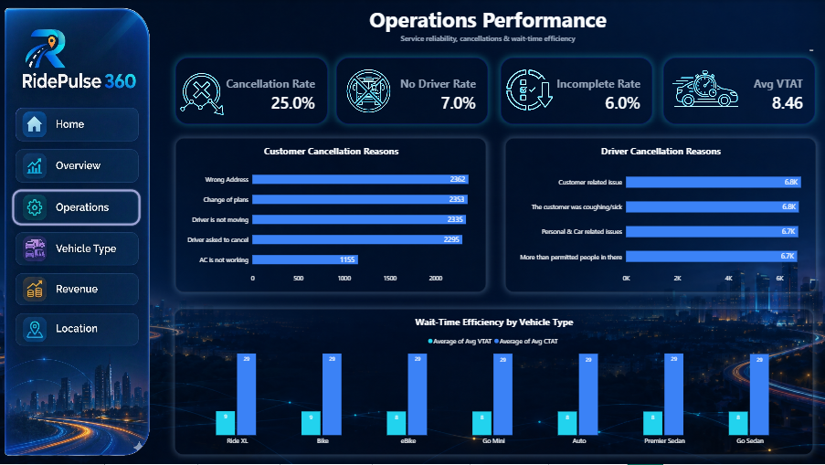
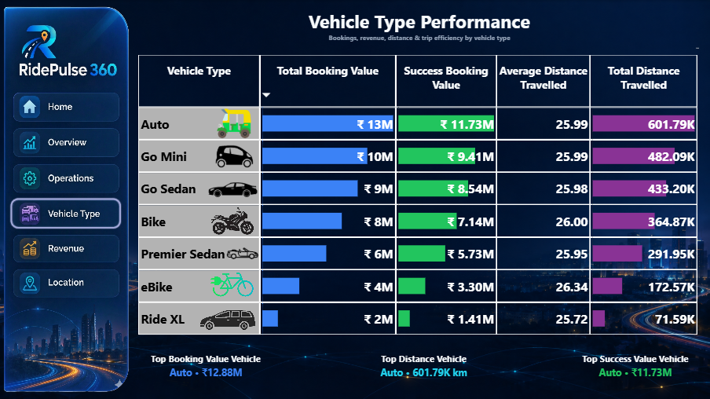
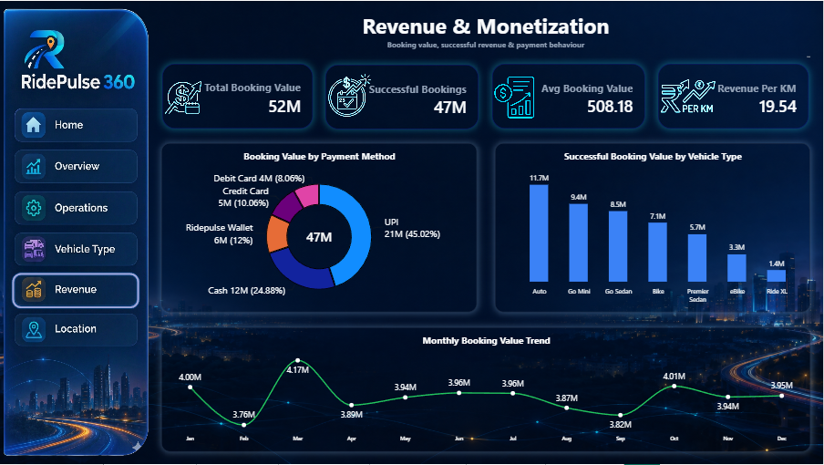
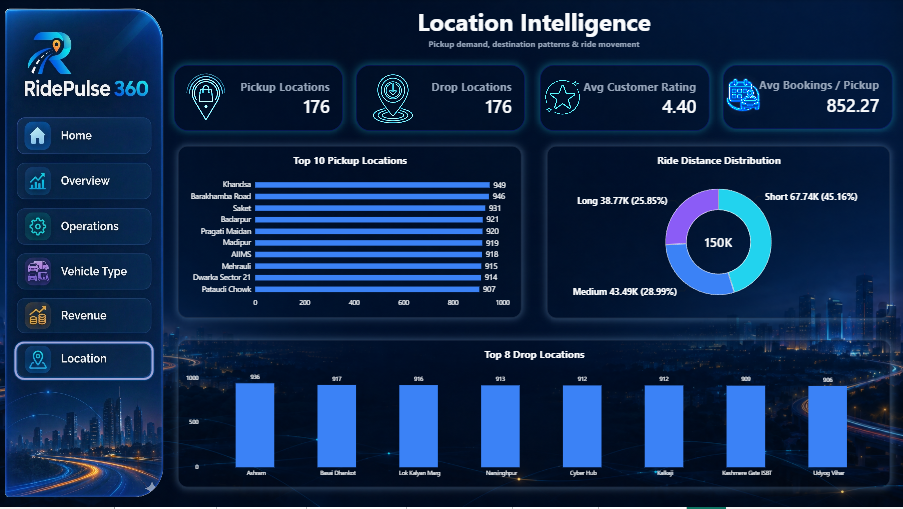

# 🚖 RidePulse 360 --- NCR Ride Booking & Mobility Intelligence

> **An interactive Power BI dashboard for analyzing ride demand,
> operational performance, vehicle utilization, revenue patterns, and
> location intelligence across an NCR ride-booking dataset.**


------------------------------------------------------------------------

## 🖼️ Dashboard Preview

### Home


### Executive Overview


### Operations Performance


### Vehicle Type Performance


### Revenue & Monetization


### Location Intelligence


---

## 📌 Project Overview

**RidePulse 360** is an end-to-end Power BI analytics project built to
transform a ride-booking dataset into an interactive business
intelligence dashboard.

The dashboard is designed from the perspective of a ride-booking and
mobility business that wants to understand:

-   How many rides are being booked and completed
-   How successful the booking business is
-   Why rides are being cancelled or remain incomplete
-   Which vehicle types contribute the most booking value
-   How booking value changes over time
-   Which payment methods contribute to successful booking value
-   Where ride demand is concentrated
-   How pickup and drop locations compare
-   How ride distances are distributed

The final dashboard contains a **Home page + 5 analytical pages**,
connected through interactive navigation.

------------------------------------------------------------------------

## 🎯 Project Objectives

The main objectives of RidePulse 360 are to:

1.  Monitor overall ride-booking performance.
2.  Measure booking completion and cancellation patterns.
3.  Identify operational issues affecting ride fulfillment.
4.  Compare vehicle types using booking value, successful booking value,
    and distance.
5.  Analyze revenue and payment-method patterns.
6.  Identify high-demand pickup and drop locations.
7.  Present business insights through a clean, executive-style Power BI
    interface.
8.  Build an interactive dashboard that is easy for both business users
    and analysts to explore.

------------------------------------------------------------------------

## 🧰 Tools & Technologies

  -----------------------------------------------------------------------
  Tool / Technology                   Purpose
  ----------------------------------- -----------------------------------
  **Microsoft Power BI**              Dashboard development and
                                      interactive reporting

  **Power Query**                     Data cleaning and transformation

  **DAX**                             Measures, KPIs and analytical
                                      calculations

  **Excel / Source Dataset**          Input data source

  **Power BI Visuals**                Charts, cards, tables, slicers and
                                      navigation

  **GitHub**                          Project documentation and version
                                      control
  -----------------------------------------------------------------------

------------------------------------------------------------------------

# 🖥️ Dashboard Structure

The dashboard is organized into six pages:

### 1. 🏠 Home

A branded landing page providing navigation to all analytical sections.

### 2. 📊 Executive Overview

A high-level view of ride performance, demand and business health.

### 3. ⚙️ Operations Performance

Focuses on cancellations, incomplete rides, driver availability and
ride-time efficiency.

### 4. 🚗 Vehicle Type Performance

Compares vehicle categories across booking value, successful booking
value and distance.

### 5. 💰 Revenue & Monetization

Analyzes booking value, successful booking value, payment methods and
monthly revenue trends.

### 6. 📍 Location Intelligence

Analyzes pickup/drop coverage, location demand and ride-distance
distribution.

------------------------------------------------------------------------

# 🏠 1. Home Page

The Home page acts as the dashboard's navigation hub.

### Features

-   RidePulse 360 branding
-   NCR Ride Booking & Mobility Intelligence subtitle
-   Navigation cards for:
    -   Overview
    -   Operations
    -   Vehicle Type
    -   Revenue
    -   Location
-   Interactive page navigation
-   Consistent dark mobility-themed design

The navigation design is intentionally different from a standard Power
BI report so that the dashboard feels like a complete business
application rather than a collection of charts.

------------------------------------------------------------------------

# 📊 2. Executive Overview

The Executive Overview provides a quick summary of the overall
ride-booking business.

### KPI Cards

  KPI                                              Dashboard Snapshot
  ---------------------------------------------- --------------------
  **Total Bookings**                                             150K
  **Completed Rides**                                             93K
  **Completion Rate**                                             62%
  **Total Revenue / Successful Booking Value**                    47M

### Visuals

#### 📈 Monthly Booking Trend

Shows the monthly booking volume across the year and highlights changes
in ride demand over time.

#### 🚦 Booking Outcome

Breaks bookings into major outcomes such as:

-   Completed
-   Cancelled by Driver
-   Cancelled by Customer
-   No Driver Found
-   Incomplete

#### 🚗 Vehicle Performance

Compares completed ride volume across vehicle types.

### Business Questions Answered

-   How many bookings were recorded?
-   How many rides were completed?
-   What percentage of bookings were completed?
-   How does booking demand change month to month?
-   What are the major booking outcomes?
-   Which vehicle types handle the highest number of completed rides?

------------------------------------------------------------------------

# ⚙️ 3. Operations Performance

The Operations page focuses on ride fulfillment and service reliability.

### KPI Cards

  KPI                       Dashboard Snapshot
  ----------------------- --------------------
  **Cancellation Rate**                  25.0%
  **No Driver Rate**                      7.0%
  **Incomplete Rate**                     6.0%
  **Avg VTAT**                            8.46

> **Note:** VTAT is retained as the metric name used in the source
> dataset/dashboard calculations. Its exact business definition should
> be interpreted according to the source dataset documentation.

### Visuals

#### 👤 Customer Cancellation Reasons

Shows the most common reasons associated with customer cancellations.

Examples visible in the dashboard include:

-   Wrong Address
-   Change of Plans
-   Driver is not moving
-   Driver asked to cancel
-   AC is not working

#### 🚘 Driver Cancellation Reasons

Shows the main reasons associated with driver-side cancellations.

#### ⏱️ Wait-Time Efficiency by Vehicle Type

Compares the available VTAT and CTAT metrics across vehicle types.

### Business Questions Answered

-   How large is the cancellation problem?
-   What percentage of bookings have no driver?
-   What percentage of rides are incomplete?
-   Why are customers cancelling?
-   Why are drivers cancelling?
-   How do ride-time metrics vary by vehicle type?

------------------------------------------------------------------------

# 🚗 4. Vehicle Type Performance

This page provides a detailed comparison of vehicle categories.

### Vehicle Types Analyzed

-   Auto
-   Go Mini
-   Go Sedan
-   Bike
-   Premier Sedan
-   eBike
-   Ride XL

### Main Table

The table compares:

  -----------------------------------------------------------------------
  Metric                              Purpose
  ----------------------------------- -----------------------------------
  **Total Booking Value**             Total booking value associated with
                                      the vehicle type

  **Success Booking Value**           Booking value from
                                      successful/completed rides

  **Average Distance Travelled**      Average ride distance

  **Total Distance Travelled**        Aggregate ride distance
  -----------------------------------------------------------------------

The table uses conditional data bars to make comparisons easier.

### Dynamic Insight Cards

#### 🏆 Top Booking Value Vehicle

Identifies the vehicle type with the highest booking value.

**Dashboard snapshot:** Auto --- ₹12.88M

#### 🛣️ Top Distance Vehicle

Identifies the vehicle type with the highest total distance travelled.

**Dashboard snapshot:** Auto --- 601.79K km

#### 💰 Top Success Value Vehicle

Identifies the vehicle type with the highest successful booking value.

**Dashboard snapshot:** Auto --- ₹11.73M

### Business Questions Answered

-   Which vehicle type generates the most booking value?
-   Which vehicle type contributes the highest successful booking value?
-   Which vehicle type travels the greatest total distance?
-   How do vehicle categories compare across business value and usage?

------------------------------------------------------------------------

# 💰 5. Revenue & Monetization

The Revenue page focuses on the financial side of the ride-booking
business.

### KPI Cards

  KPI                              Dashboard Snapshot
  ------------------------------ --------------------
  **Total Booking Value**                         52M
  **Successful Booking Value**                    47M
  **Average Booking Value**                    508.18
  **Revenue Per KM**                            19.54

### Visuals

#### 💳 Booking Value by Payment Method

The dashboard shows successful booking value distributed across payment
methods, including:

-   UPI
-   Cash
-   Ridepulse Wallet
-   Credit Card
-   Debit Card

The visual also displays each payment method's contribution as a
percentage.

#### 🚗 Successful Booking Value by Vehicle Type

Compares successful booking value generated by each vehicle category.

The dashboard snapshot shows Auto at the highest value, followed by Go
Mini, Go Sedan, Bike, Premier Sedan, eBike and Ride XL.

#### 📈 Monthly Booking Value Trend

Tracks successful booking value across the year.

### Business Questions Answered

-   What is the total booking value?
-   How much value comes from successful rides?
-   What is the average booking value?
-   What is the revenue generated per kilometre?
-   Which payment methods contribute the most value?
-   Which vehicle types generate the most successful booking value?
-   How does booking value change throughout the year?

------------------------------------------------------------------------

# 📍 6. Location Intelligence

The Location page focuses on geographic coverage and demand patterns.

### KPI Cards

  KPI                               Dashboard Snapshot
  ------------------------------- --------------------
  **Active Pickup Locations**                      176
  **Active Drop Locations**                        176
  **Average Customer Rating**                     4.40
  **Average Bookings / Pickup**                 852.27

### Visuals

#### 📍 Top 10 Pickup Locations

Ranks the pickup locations with the highest booking volume.

The dashboard snapshot highlights locations such as:

-   Khandwa
-   Barakhamba Road
-   Saket
-   Badarpur
-   Pragati Maidan
-   Madipur
-   AIIMS
-   Mehrauli
-   Dwarka Sector 21
-   Pataudi Chowk

#### 🏁 Top Drop Locations

Shows the locations receiving the highest ride volume.

#### 🍩 Ride Distance Distribution

Segments rides into:

-   **Short:** 45.16%
-   **Medium:** 28.99%
-   **Long:** 25.85%

### Business Questions Answered

-   How many pickup locations are active?
-   How many drop locations are active?
-   Which pickup areas have the highest demand?
-   Which drop areas receive the most rides?
-   What proportion of rides fall into short, medium and long-distance
    categories?
-   What is the average booking volume per pickup location?

------------------------------------------------------------------------

# 🧹 Data Preparation

The project follows a data-preparation workflow before dashboard
development.

### Data preparation activities include:

-   Reviewing the source schema
-   Checking missing/null values
-   Preserving valid records instead of unnecessarily deleting data
-   Standardizing fields used for analysis
-   Preparing categorical and numerical columns for Power BI
-   Creating analytical measures in DAX
-   Validating calculated KPIs against the source data
-   Formatting numeric values for dashboard readability

### Data Integrity Principle

A key principle used during cleaning was:

> **Do not remove a record simply because a field contains a blank
> value.**

Nulls were considered based on whether the missing value affected the
specific analysis. This helps reduce accidental data loss while keeping
the analytical results meaningful.

------------------------------------------------------------------------

# 🧮 DAX & Analytical Calculations

The dashboard uses DAX measures for reusable calculations such as:

-   Total Bookings
-   Completed Rides
-   Completion Rate
-   Total Revenue / Successful Booking Value
-   Average Booking Value
-   Revenue Per KM
-   Cancellation Rate
-   No Driver Rate
-   Incomplete Rate
-   Average Customer Rating
-   Average Distance
-   Total Distance
-   Active Pickup Locations
-   Active Drop Locations
-   Average Bookings per Pickup Location

### Example: Completion Rate

``` dax
Completion Rate =
DIVIDE(
    [Completed Rides],
    [Total Bookings],
    0
)
```

### Example: Average Bookings per Pickup

``` dax
Avg Bookings per Pickup =
DIVIDE(
    [Total Bookings],
    [Active Pickup Locations],
    0
)
```

The project also uses DAX-driven dynamic vehicle insights so that the
highlighted vehicle can change when report selections/filter context
change.

------------------------------------------------------------------------

# 🎨 Dashboard Design System

RidePulse 360 uses a consistent dark, mobility-focused visual language.

### Primary Colors

  Purpose                Color           HEX
  ---------------------- --------------- -----------
  Deep Navy Background   Deep Navy       `#0B1220`
  Card Background        Slate Navy      `#111C2E`
  Border                 Blue Gray       `#24344D`
  Main Text              White           `#F8FAFC`
  Secondary Text         Slate Gray      `#94A3B8`
  Primary Accent         Electric Blue   `#3B82F6`
  Success                Emerald         `#22C55E`
  Secondary Accent       Cyan            `#22D3EE`
  Highlight              Amber           `#F59E0B`
  Vehicle Accent         Violet          `#8B5CF6`

The design uses consistent cards, spacing, typography, navigation and
visual hierarchy across all pages.

------------------------------------------------------------------------

# 💡 Key Dashboard Insights

Based on the dashboard snapshot:

-   The report contains approximately **150K total bookings** and **93K
    completed rides**.
-   The overall completion rate is approximately **62%**.
-   Cancellation rate is approximately **25%**.
-   Auto has the highest booking value and successful booking value
    among the displayed vehicle categories.
-   Auto also has the highest total distance travelled in the vehicle
    comparison.
-   UPI contributes the largest share of successful booking value in the
    payment-method analysis.
-   Pickup and drop activity covers **176 locations** in the dashboard.
-   The ride-distance distribution shows that **short-distance rides
    form the largest share** of rides in the current snapshot.
-   Booking value varies by month, with visible peaks and dips
    throughout the year.
-   Customer and driver cancellation reasons provide operational areas
    that can be investigated further.

> These observations describe the current dashboard snapshot. They are
> not forecasts or causal conclusions.

------------------------------------------------------------------------

# 📋 Business Questions Covered

The dashboard was designed around practical business questions:

### Performance

-   How many rides are being booked?
-   How many are completed?
-   What is the completion rate?

### Operations

-   Why are rides being cancelled?
-   How often are drivers unavailable?
-   How many rides are incomplete?
-   How do ride-time metrics vary?

### Vehicle

-   Which vehicle types generate the highest booking value?
-   Which vehicle types generate the highest successful value?
-   Which vehicle types travel the most distance?

### Revenue

-   What is the total booking value?
-   What is the successful booking value?
-   Which payment methods contribute the most value?
-   How does booking value change monthly?

### Location

-   Where is demand concentrated?
-   Which pickup locations are busiest?
-   Which drop locations are busiest?
-   How are rides distributed by distance?

------------------------------------------------------------------------

# 🔄 Interactive Features

The dashboard includes:

-   Multi-page navigation
-   Sidebar navigation
-   Home-page navigation cards
-   Interactive Power BI visuals
-   Cross-filtering between visuals
-   Dynamic DAX measures
-   Top-N location analysis
-   Conditional data bars
-   KPI cards
-   Drillable analytical views where supported by the report design

------------------------------------------------------------------------

# 🚀 How to Use

### 1. Clone or download the repository

### 2. Open the `.pbix` file in Microsoft Power BI Desktop

### 3. If the dataset path is different:

Go to:

**Home → Transform data → Data source settings**

and update the source location.

### 4. Refresh the data

Select:

**Home → Refresh**

### 5. Explore the dashboard

Use the navigation buttons to move between:

**Home → Overview → Operations → Vehicle Type → Revenue → Location**

------------------------------------------------------------------------

# 📊 Project Outcome

RidePulse 360 transforms raw ride-booking data into a structured
business intelligence solution.

Instead of presenting raw tables, the project organizes the analysis
into five business perspectives:

> **Business Health → Operations → Vehicle Performance → Revenue →
> Location Intelligence**

This makes it possible for a user to move from a high-level business
summary to detailed operational and location-level analysis within the
same report.

------------------------------------------------------------------------

# 🔮 Future Improvements

Possible future enhancements include:

-   Adding a dedicated date/calendar slicer across all pages
-   Adding city/region-level geographic mapping
-   Adding customer segmentation
-   Adding driver performance analysis
-   Adding revenue forecasting
-   Adding cancellation trend forecasting
-   Adding drill-through pages for individual locations
-   Adding automated Power BI Service refresh
-   Adding Row-Level Security for different business users
-   Connecting the dashboard to a live database instead of a static
    dataset

------------------------------------------------------------------------

# 🧠 Skills Demonstrated

This project demonstrates practical skills in:

-   Power BI
-   Power Query
-   DAX
-   Data Cleaning
-   Data Transformation
-   KPI Development
-   Business Intelligence
-   Data Visualization
-   Dashboard UI/UX
-   Interactive Report Navigation
-   Business Problem Solving
-   Exploratory Data Analysis
-   Data Storytelling

------------------------------------------------------------------------

# 👨‍💻 Project Type

**Portfolio Project --- Business Intelligence / Data Analytics**

### Project Name

**RidePulse 360**

### Domain

**Ride Booking & Mobility Analytics**

### Primary Tool

**Microsoft Power BI**

### Focus

**Business Intelligence • Data Analytics • Data Visualization**

------------------------------------------------------------------------

## ⭐ Final Summary

**RidePulse 360** is a Power BI-based ride-booking analytics dashboard
designed to convert operational booking data into actionable business
intelligence.

The project combines data preparation, DAX calculations, interactive
visualizations, KPI design and application-style navigation to provide a
complete analytical experience covering **business performance,
operations, vehicle types, revenue and location intelligence**.
